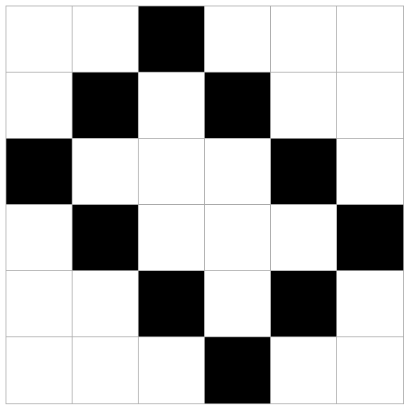

# Pixelgenerator


## Aufgabenstellung

Erstelle ein PHP-Script, welches aufgrund der mitgegebenen GET-Variablen eine Tabelle zur Darstellung eines Pixelbildes generiert.

### Zielumgebung

Das Script soll eine HTML-Seite generieren. Rufe es also in Deinem Webbrower auf.

### Lösungsschritte

Entwickle das Script immer nur so weit, bis einer dieser Schritte erfüllt wird. Erweitere es anschliessend, damit der nächste Schritt erfüllt wird.

#### Schritt 1

Erstelle eine einfache HTML-Seite ohne PHP-Code. Auf der Seite soll eine Tabelle mit 4 Spalten und 4 Zeilen angezeigt werden.

Kopiere das Stylesheet `src/styles.css` in Dein Verzeichnis und binde es in das Dokument ein. 

Du solltest nun eine vertikal und horizontal zentrierte Tabelle erhalten.

#### Schritt 2

Erstelle am Anfang Deines Scripts nun je eine Variable für die Anzahl Spalten (`$cols`) und die Anzahl Zeilen (`$rows`). Nutze PHP um die Tabelle dynamisch anhand der Werte der beiden Variablen zu generieren.

```php
<?php
// Tabelle 4x4 wird generiert
$cols = 4;
$rows = 4;

// Tabelle 8x6 wird generiert
$cols = 8;
$rows = 6;
?>
```

#### Schritt 3

Wir möchten nun die Möglichkeit haben, via URL-Parameter bestimmen zu können, wie viele Spalten und wie viele Zeilen die Tabelle haben soll.

Beide Parameter sollen optional sein und einen Standard-Wert von 4 haben.

##### Testfälle

|                      URL                       | Spalten | Zeilen |
|------------------------------------------------|---------|--------|
| http://localhost/pixel/index.php               |       4 |      4 |
| http://localhost/pixel/index.php?rows=2        |       4 |      2 |
| http://localhost/pixel/index.php?cols=2        |       2 |      4 |
| http://localhost/pixel/index.php?cols=2&rows=2 |       2 |      2 |

Du kannst über die Superglobale `$_GET` auf Parameter aus der URL zugreiffen.

```php
<?php
// script.php?x=1
$x = $_GET['x'];

// script.php?x=1&y=2
$y = $_GET['y'];
?>
```

* Wie könntest Du hier den [Null Coalesce Operator](Link zu Doku einfügen, sobald vorhanden!@TODO) verwenden?

#### Schritt 4

Grundsätzlich sollten wir User-Input nie trauen. Die GET-Parameter sind vom User frei bestimmbar und können missbraucht werden. Was, wenn eine Spalten-Anzahl von `10000000` eingegeben wird? Was, wenn eine Anzahl von `keineZahl` eingegeben wird?

Stelle sicher, dass die folgenden Regeln erfüllt werden.


##### Regeln

* `$cols` und `$rows` sollen **immer** ein Integer sein (siehe [Type Casting](https://secure.php.net/manual/de/language.types.type-juggling.php#language.types.typecasting)
* Die maximale Anzahl von Spalten oder Zeilen soll `60` sein.
* Die minimale Anzahl von Spalten oder Zeilen soll `1` sein.

#### Schritt 5

Wir möchten nun über einen weiteren GET-Parameter `pixels` mehrere Koordinaten bestimmen können, für Tabellen-Zellen, die schwarz einzufärben sind. 

Die CSS-Klasse `.mark` ist im CSS-File bereits vorbereitet. Diese Klasse kannst Du also Zellen vergeben, die markiert werden sollen.

```html
<td class="mark"></td> <!-- diese Zelle wird schwarz -->
```

Die Pixel-Koordinaten werden als String im Format `x|y` definiert. Möchten wir z. B. die 2. Zelle auf der 3. Zeile markieren, wären die Koordinaten `2|3`.

Da wir mehrere Koordinaten an das PHP-Script übergeben möchten, können wir den GET-Parameter `pixels` als Array übergeben. Dies geschieht, indem `[]` an den Parametername angehängt wird. 

```
http://localhost/pixels/index.php?pixels[]=1|2&pixels[]=2|1
```

Erweitere das PHP-Script so, dass über folgende Query-Strings die korrekten Pixel markiert werden:

|                  Query-String                            | Output            |
|----------------------------------------------------------|-------------------|
| ?rows=2&cols=2&pixels[]=1\|2&pixels[]=2\|2               |  |
| ?rows=3&cols=3&pixels[]=3\|1&pixels[]=1\|3               |  |
| ?rows=3&cols=3&pixels[]=1\|1&pixels[]=2\|2&pixels[]=3\|3 |  |

##### Schritt 6

Mit welchem Query-String erhältst Du diesen Output?

 

## Lösung

Du findest mögliche Lösungen zu allen Schritten im `src` Verzeichnis. Natürlich ist die Ausgabe des Scripts entscheidend, nicht der Code dazu.

Es sind also mehrere Lösungen möglich, solange durch die richtige Logik die gewünschte Ausgabe erzeugt wird.
