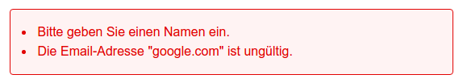

# Formular verarbeiten und validieren

Nutze als Basis für diese Aufgabe das Anmelde-Formular für den Firmenevent. 
Stelle sicher, dass Dein Projekt folgende Struktur hat:

```php
formular/
 | css/
 | css/styles.css      # Dateiname nicht relevant
 | index.php           # In dieser Datei sollte Dein Formular sein
```

## Aufgabenstellung

Erweitere Deine Formular-Datei so, dass beim Absenden des Formulares die Daten validiert und im Fehlerfall eine Fehlermeldung angezeigt wird.


### Lösungsschritte

Entwickle das Script immer nur so weit, bis einer dieser Schritte erfüllt wird. Erweitere es anschliessend, damit der nächste Schritt erfüllt wird.

#### Schritt 1

Bereite die Fehlerausgabe vor. Zu Beginn des Formulares soll bei nicht validen Daten eine Auflistung der jeweils fehlerhaften Felder erstellt werden. Erstelle diese Liste mit HTML-Code und nutze CSS für die Formatierung.



#### Schritt 2

Lagere die «Beispielfehler» nun in ein PHP-Array am Anfang Deines Dokumentes aus. Nutze `foreach` um die Fehler als Liste auszugeben. Zeige die Liste nicht an, wenn das Array leer ist!

```php
$errors = [];  // --> Keine Fehlerliste anzeigen
$errors = [    // --> Liste wie unter Schritt 1 anzeigen
    'Bitte geben Sie einen Namen ein.',
    'Die Email-Adresse "google.com" ist ungültig.'
];
```

Sobald die Ausgabe wie gewüscht funktioniert, entferne alle Beispielfehler aus dem Array, damit standardmässig keine Fehlerausgaben erscheinen.

```php
$errors = [];
```

#### Schritt 3

Erstelle am Anfang Deines Dokumentes einen PHP-Block, der mit Hilfe der `var_dump`-Funktion alle via POST-Methode gesendeten Daten ausgibt. Diese Ausgabe soll **nur dann erscheinen**, wenn das Formular auch wirklich abgesendet wurde!

```php
// Beispielausgabe
array (size=7)
  'name' => string '' (length=0)
  'email' => string '' (length=0)
  'phone' => string '' (length=0)
  'people' => string '' (length=0)
  'hotel' => string 'InterContinental Davos' (length=22)
  'program' => string '' (length=0)
  'note' => string '' (length=0)
```

#### Schritt 4

Dort, wo Du momentan mit `var_dump` die Daten ausgibst, kannst Du diese nun validieren.

Füge für fehlerhafte Eingaben die entsprechende Fehlermeldung zu Deinem `$errors`-Array hinzu.
Pro Feld soll immer nur ein Fehler angezeigt werden. Falls die Email-Adresse also nicht eingegeben wurde, sollte diese nicht auch noch als fehlerhaft angezeigt werden!

Alle Felder, ausser das für die Bemerkung, sind Pflichtfelder.

Für die Validierung der Email-Adresse überprüfen wir nur, ob die Eingabe ein `@` enthält.

Für die Telefonnummer dürfen nur Zahlen, Leerzeichen und das `+` Symbol eingegeben werden. Alle anderen Eingaben sind ungültig.

Wenn keine Fehler vorhanden sind, gib einfach nur den String `OK` nach der Validierung der Daten aus.

Die folgenden Testfälle sollte Dein Formular erfüllen. 

|       Feld      |        Input        |                      Ferhlermeldung                     |
|-----------------|---------------------|---------------------------------------------------------|
| Name            | `''`  *(leer)*      | Bitte geben Sie einen Namen ein.                        |
| Email           | `''`                | Bitte geben Sie eine Email ein.                         |
| Telefon         | `''`                | Bitte geben Sie eine Telefonnummer ein.                 |
| Anzahl Personen | `''`                | Bitte geben Sie die Anzahl teilnehmender Personen ein.  |
| Hotel           | `''`                | Bitte wählen Sie ein Hotel für die Übernachtung aus.    |
|                 |                     |                                                         |
| Email           | `'google.com'`      | Die Email-Adresse "google.com" ist ungültig.            |
| Telefon         | `'phone'`           | Die Telefonnummer "phone" ist ungültig.                 |
| Anzahl Personen | `'Acht'`            | Bitte geben Sie für die Anzahl Personen nur Zahlen ein. |
|                 |                     |                                                         |
| Email           | `'test@google.com'` | **keine**                                               |
| Email           | `'info@cern.ch '`   | **keine**                                               |
| Telefon         | `'+41 260 30 39'`   | **keine**                                               |
| Name            | `'Peter'`           | **keine**                                               |
| Anzahl Personen | `'5'`               | **keine**                                               |
| Bemerkung       | `''`                | **keine**                                               |
    

#### Schritt 5

Eingaben bei Fehler wieder in Inputs anzeigen.

## Lösung

Du findest mögliche Lösungen zu allen Schritten im `src` Verzeichnis. Natürlich ist die Ausgabe und Funktionalität des Scripts entscheidend, nicht der Code dazu.